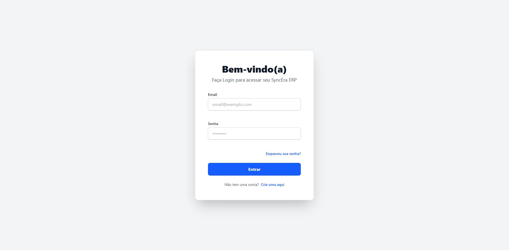
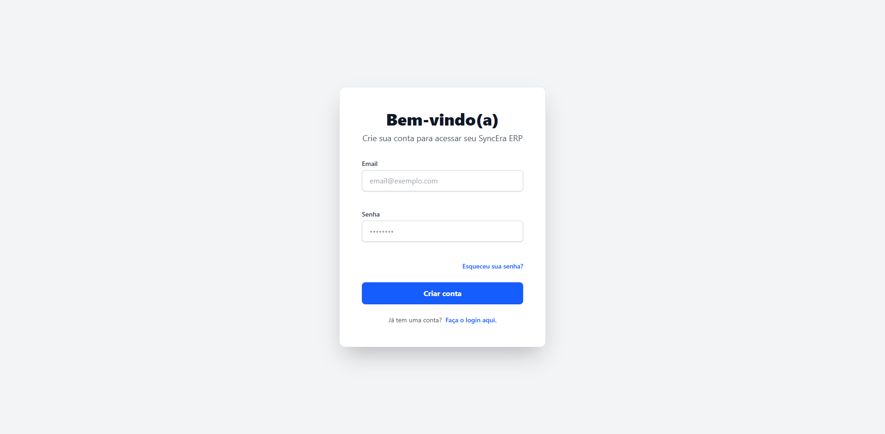
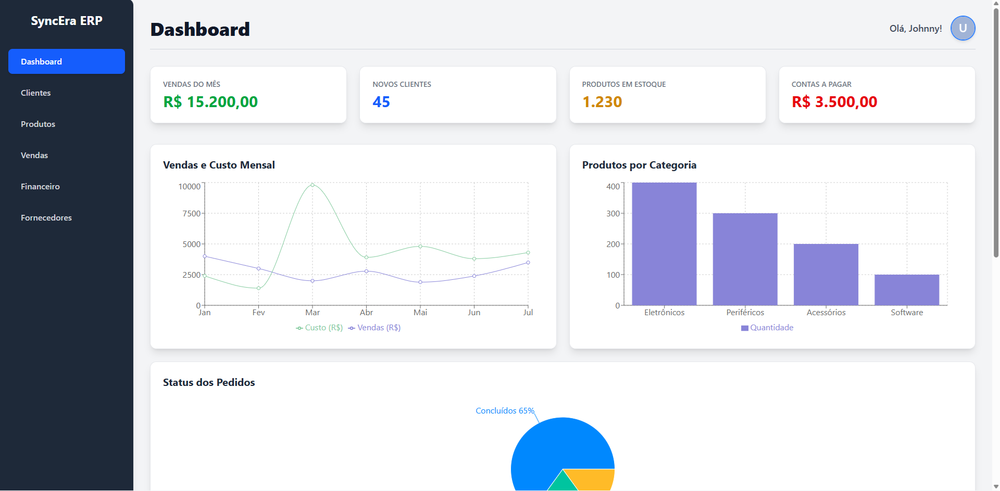
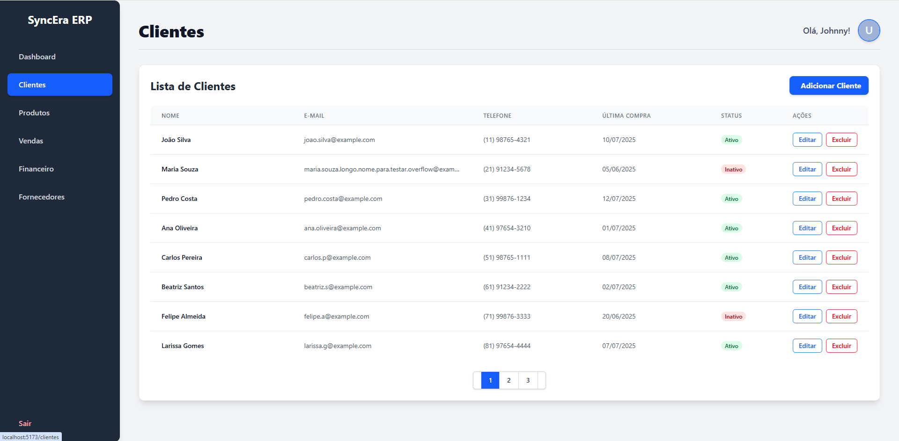
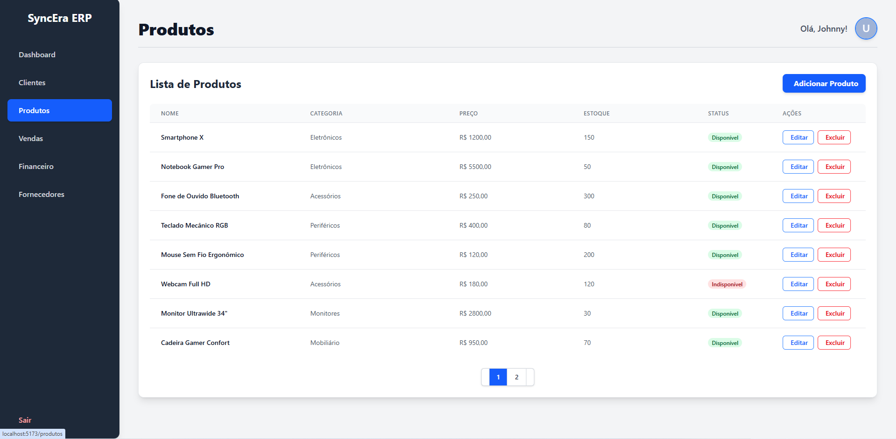
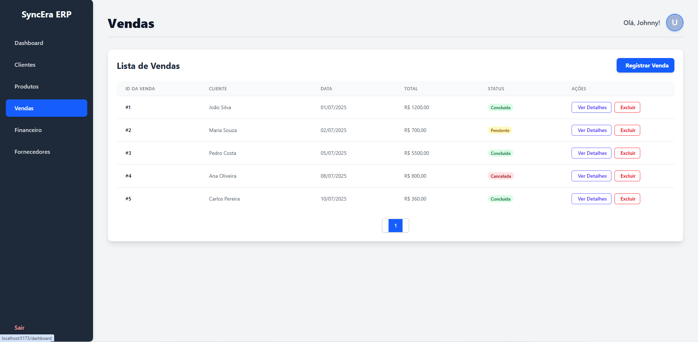
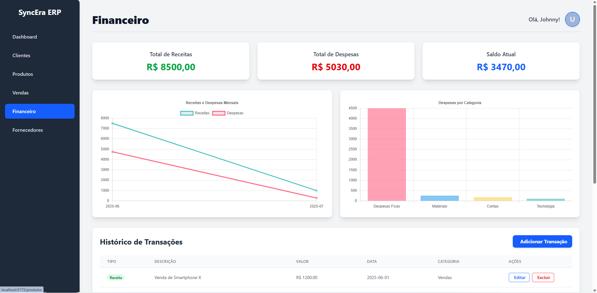
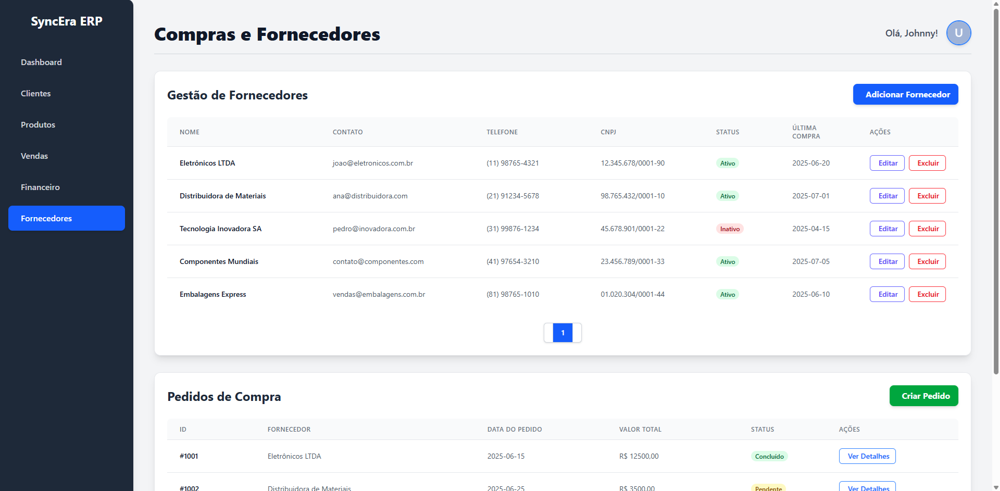

<p align="center">
  
  
  
  
  
  
  
  
</p>

# SyncEra ERP - Sistema de Gestão Empresarial

Este repositório contém o projeto pessoal **SyncEra ERP**, um sistema de gestão empresarial abrangente desenvolvido para simular e gerenciar operações internas de um negócio. O projeto foca na integração de módulos essenciais de ERP, como gestão de clientes, produtos, vendas, finanças, estoque e compras, com um frontend dinâmico e responsivo. O objetivo principal foi aprofundar o conhecimento em desenvolvimento Full Stack com React no frontend e Node.js no backend, praticando operações CRUD e gerenciamento de estado complexo.

## Tecnologias Utilizadas:

### Front-end:

- **React:** Biblioteca JavaScript para construção de interfaces de usuário.
- **Vite:** Ferramenta de build rápida para desenvolvimento web.
- **Tailwind CSS:** Framework CSS utilitário para estilização rápida e responsiva.
- **Axios:** Cliente HTTP baseado em Promises para realizar requisições assíncronas às APIs.
- **React Router DOM:** Para gerenciamento de rotas na aplicação single-page.
- **Recharts:** Biblioteca de gráficos para visualização de dados no Dashboard.
- **Font Awesome:** Biblioteca de ícones.

### Back-end:

- **Node.js:** Ambiente de execução JavaScript para o desenvolvimento do servidor.
- **Express.js:** Framework web para Node.js, utilizado para construir APIs RESTful.
- **Knex.js:** Construtor de query SQL, utilizado como ORM para interação com o banco de dados.
- **JSON Web Tokens (JWT):** Para autenticação e autorização seguras de usuários.
- **BCrypt:** Para hashing de senhas.
- **Dotenv:** Para gerenciamento de variáveis de ambiente.

## Funcionalidades Principais do SyncEra ERP:

- **Dashboard Interativo:** Visão geral com indicadores chave de desempenho (KPIs) e gráficos visuais (vendas, categorias de produtos, status de pedidos) para insights rápidos.
- **Gestão de Clientes:**
  - Criação, visualização, edição e exclusão de registros de clientes.
  - Filtros e busca avançada de clientes.
- **Gestão de Produtos e Estoque:**
  - Cadastro, consulta, atualização e remoção de informações de produtos.
  - Controle de estoque integrado com a página de produtos, incluindo quantidade disponível.
- **Gerenciamento de Vendas:**
  - Registro e acompanhamento de pedidos de venda.
  - Detalhes de vendas e status.
- **Controle Financeiro:**
  - Gestão de contas a pagar e a receber.
  - Lançamentos financeiros e acompanhamento de fluxo de caixa (simulado).
- **Compras e Fornecedores:**
  - Cadastro e gerenciamento de fornecedores.
  - Registro e visualização de pedidos de compra (simulados).
- **Administração de Usuários:**
  - Autenticação de usuários (registro e login com JWT).
  - Gerenciamento básico de perfil de usuário.
- **Atividades Recentes:** Tabela com log de atividades do sistema, demonstrando as últimas operações.
- **Interface Responsiva:** O layout se adapta a diferentes tamanhos de tela (desktops, tablets, celulares).

## Link do Projeto:

[https://synceria-erp.vercel.app/](https://synceria-erp.vercel.app/)

## Como Rodar o Projeto Localmente:

### Pré-requisitos:

- Node.js (versão 18 ou superior recomendada)
- npm ou Yarn (gerenciador de pacotes)
- PostgreSQL (ou outro banco de dados suportado pelo Knex.js)

### Passos:

1.  **Clone o repositório:**

    ```bash
    git clone [https://github.com/JoZeng/SyncEra-ERP.git](https://github.com/JoZeng/SyncEra-ERP.git) # Atualize com o seu usuário e nome do repositório
    cd SyncEra-ERP
    ```

2.  **Instale as dependências do Back-end:**
    Navegue até a pasta do seu backend (ex: `server`, `backend`, ou na raiz se for um projeto fullstack monolítico com o backend na raiz).

    ```bash
    # Exemplo: se o backend estiver em uma pasta 'backend'
    cd backend
    npm install # ou yarn install
    ```

3.  **Configure o Banco de Dados do Back-end:**

    - Crie um arquivo `.env` na raiz da pasta do seu backend.
    - Adicione as variáveis de ambiente necessárias para a conexão com o banco de dados (exemplo para PostgreSQL):
      ```
      DB_HOST=localhost
      DB_USER=seu_usuario_bd
      DB_PASSWORD=sua_senha_bd
      DB_NAME=synceradb
      DB_PORT=5432
      JWT_SECRET=sua_chave_secreta_jwt
      ```
    - Execute as migrações para criar as tabelas no seu banco de dados:
      ```bash
      npx knex migrate:latest
      ```

4.  **Inicie o Back-end:**

    ```bash
    npm start # ou node index.js, dependendo do seu script de inicialização
    ```

    O backend geralmente roda na porta `3000` ou `3333`.

5.  **Instale as dependências do Front-end:**
    Navegue até a pasta do seu frontend (ex: `frontend`, `client`, ou na raiz se for um projeto fullstack monolítico com o frontend na raiz).

    ```bash
    # Exemplo: se o frontend estiver na raiz do repositório
    cd .. # Se você estava na pasta do backend
    npm install # ou yarn install
    ```

    Certifique-se de que o arquivo `src/services/api.js` está apontando para o seu backend local (ex: `http://localhost:3000`).

6.  **Inicie o Front-end:**
    ```bash
    npm run dev # ou yarn dev (se estiver usando Vite)
    ```
    O frontend geralmente abrirá no seu navegador em `http://localhost:5173` (padrão Vite) ou outra porta.

---

**Observações:**

- **Imagens:** Recomendo que você substitua os `src/assets/cubosX.png` por screenshots reais do seu `SyncEra ERP` para dar uma ideia melhor do seu projeto.
- **Links:** Atualize o `Link do projeto` com o seu link real do Vercel, Netlify ou outro serviço de deploy.
- **Nome do Repositório:** Certifique-se de que `git clone https://github.com/JoZeng/SyncEra-ERP.git` reflita o seu nome de usuário do GitHub e o nome exato do repositório que você criou.
- **Estrutura de Pastas:** Ajuste os comandos `cd backend` ou `cd ..` conforme a estrutura de pastas real do seu projeto (se o frontend e o backend estiverem em subpastas separadas ou se tudo estiver na raiz).

Este README está muito mais completo e específico para o seu projeto ERP!
